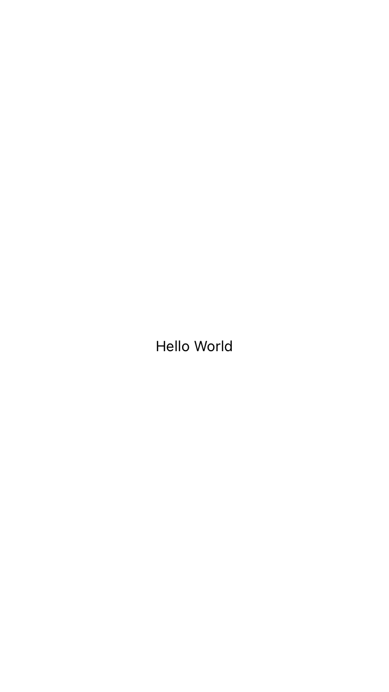
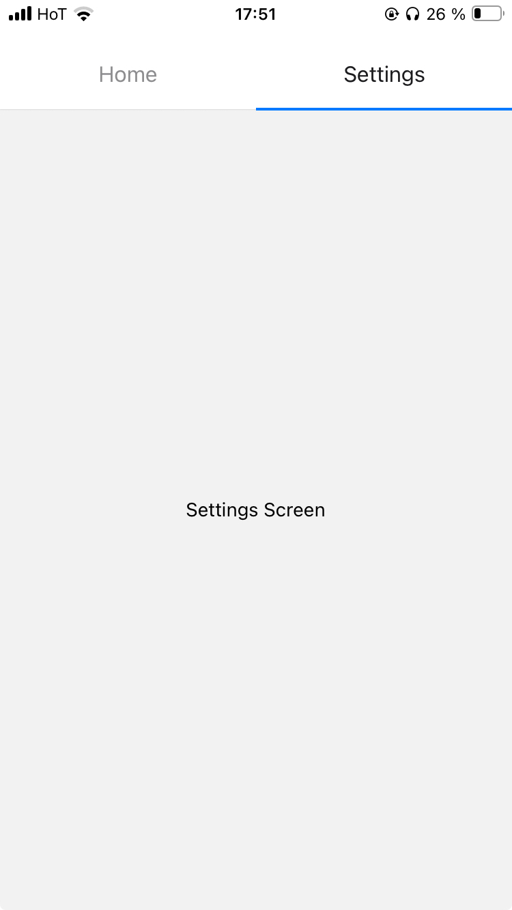
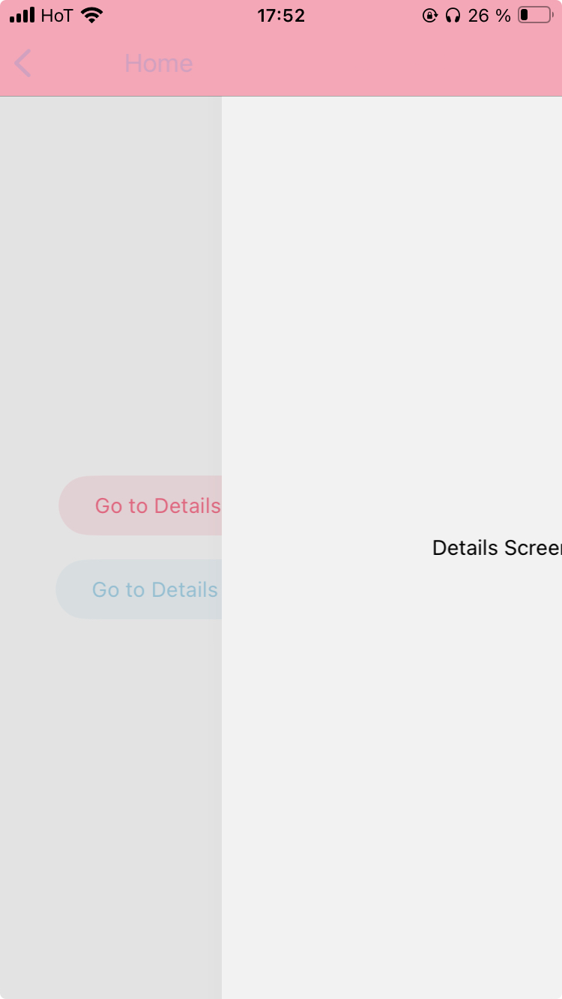
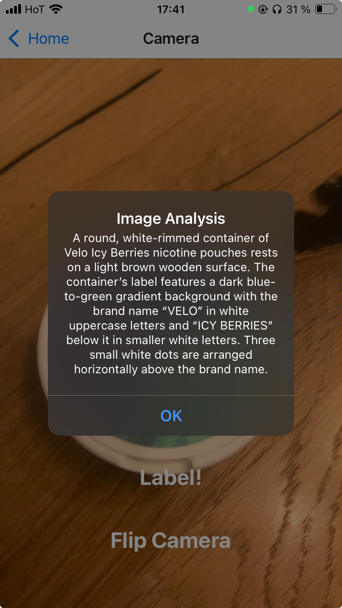
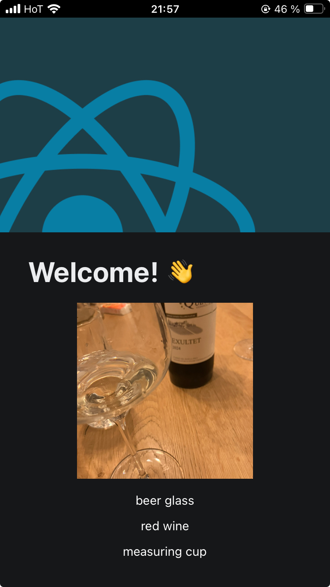

A collection of minimal apps to get myself started with React Native.

* One folder for each app.
* Starting with a very basic Hello World
* Building up to something which might actually be useful.

### Apps

| App         | Purpose                     |
|:-------------|-----------------------------|
| hello_world 			| Simple text       			|
| nav_swipe 			| Swipe between two screens      |
| nav_swipe2         | Swipe from buttons, go back, rubber-band scroll      |
| camera             | use camera + label with [moondream API](https://moondream.ai/)      |
| mobilenet          | local [mobilenet](https://github.com/onnx/models/tree/main/validated/vision/classification/mobilenet) inference w/ onnxruntime      |


<table>
  <tr>
    <td>hello world</td>
    <td>nav_swipe</td>
    <td>nav_swipe2</td>
    <td>camera</td>
  </tr>
  <tr>
    <td></td>
    <td></td>
    <td></td>
    <td></td>
  </tr>
  <tr>
    <td>mobilenet</td>
    <td></td>
    <td></td>
    <td></td>
  </tr>
  <tr>
    <td></td>
    <td></td>
    <td></td>
    <td></td>
  </tr>
</table>

### Observations 
Random things I noticed coming from Next.JS.

#### Day 1
* Basic hello world app from expo template `npx create-expo-app --template expo-template-blank` is 259 MB
* press Ctrl + D (or shake your device) to open the developer menu
* [StatusBar](https://reactnative.dev/docs/statusbar)
   * `hidden` hides the top bar 
* [Expo Component List](https://docs.expo.dev/versions/latest/)
* [View Component](https://reactnative.dev/docs/view)
   * the most fundamental building block for creating user interfaces. equivalent of a `<div>` in web development
   * Flexbox by Default: React Native uses flexbox for all layout. flexDirection defaults to column (unlike the web, where it defaults to row).
   * No Inherited Styles
   * Nested, yes
* Navigation with [React Navigation](https://reactnavigation.org/docs/getting-started/)
   * Have to position the TopNavigator bar manually? That's weird
   * [React Navigation Elements](https://reactnavigation.org/docs/elements)
* I have to implement my own Button component I think, using this one for now `import { Button } from '@react-navigation/elements'`

#### Days 2-4
* expo is a mess
* react native is a mess
* npm creates a mess, every time
* nothing works
* delete half of disk including wedding photos to update xcode. delete even more to update ios to update to most recent xcode
* hello world app finally runs on my phone

#### Day 5
* Painful realization: transformer.js does not work with react native

#### Day 6
* Start rewriting transformers.js for react native. Even the most simple things are a pain
* Add `mobilenet`: img classification (imagenet) w/ onnxruntime, image picker

### Run

#### Expo Go
Testing on iOS

* Install "Expo Go"

* cd into app dir

```bash
npm install expo
npx expo start
```

* Scan QR Code on phone

#### iOS

```bash
npx expo run:ios --device
```
